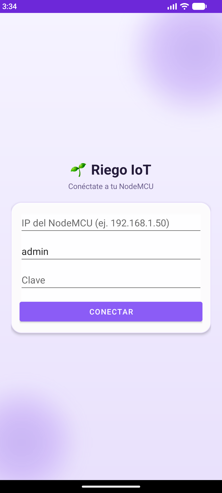
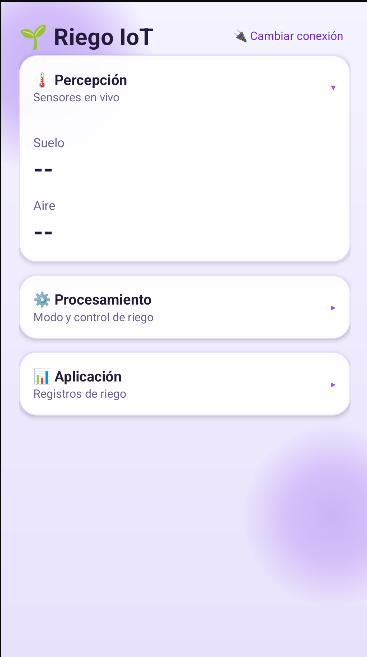

<div align="center">

# 🌱 Riego IoT con NodeMCU

**Riego automático (o manual) con sensores reales y control desde el celular**


Lee temperatura y humedad del aire (DHT22) y humedad del suelo, decide cuándo regar, y se controla en modo **automático** o **manual** desde una página web o una app Android — ambas dentro de la misma red WiFi, con corte de seguridad para que la bomba nunca quede regando sola.

<p align="center">
  
  
</p>

</div>

---

## 📋 Índice

- [✨ Qué hace](#-qué-hace)
- [🧰 Materiales](#-materiales)
- [🔌 Conexión](#-conexión)
- [🚰 Bomba real](#-bomba-real)
- [⚙️ Instalación](#️-instalación)
- [🎚️ Calibración del sensor de suelo](#️-calibración-del-sensor-de-suelo)
- [🧠 Cómo funciona](#-cómo-funciona)
- [📡 API JSON](#-api-json)
- [📱 App Android](#-app-android)
- [🗂️ Estructura](#️-estructura)

## ✨ Qué hace

- 🌡️ **Monitoreo en vivo** — temperatura y humedad del aire (DHT22) y humedad del suelo, refrescado cada 2 s.
- 🤖 **Modo automático** — riega cuando el suelo baja de un umbral y se apaga solo al subir de otro (histéresis, sin encendidos/apagados en cadena).
- 📱 **Modo manual** — botones ENCENDER / APAGAR desde la página web o la [app Android](#-app-android), ambas protegidas con usuario y clave.
- 🛑 **Corte de seguridad** — la bomba nunca riega más de 15 s seguidos ni corre en seco si el sensor falla.
- 📶 **Resiliente sin WiFi** — si no hay red, el riego automático sigue funcionando; solo se pierde la página.

> Estado: la salida de la bomba usa por defecto el **LED integrado** como "bomba virtual". La bomba real necesita una pieza extra (ver [Bomba real](#-bomba-real)).

## 🧰 Materiales

| Pieza | Uso |
|---|---|
| NodeMCU ESP8266 (ESP-12E) | Microcontrolador con WiFi |
| DHT22 | Temperatura y humedad del aire |
| Sensor de humedad de suelo (analógico) | Humedad del suelo |
| Mini bomba sumergible 3–6 V | Riego |
| Protoboard y cables | Conexiones |
| *(opcional)* BH1750 | Intensidad de luz (I2C) — si no está conectado, el firmware lo detecta al arrancar y simplemente omite esa lectura |
| *(para la bomba real)* transistor NPN + resistencia + diodo, relé o driver | Interruptor de la bomba |

> **Pendiente, no incluido:** un anemómetro (sensor de viento) requeriría un ADC externo por I2C (ej. ADS1115), porque el ESP8266 solo tiene un pin analógico (A0) y ya lo usa el sensor de suelo.

## 🔌 Conexión

| Componente | Pin del componente | Pin del NodeMCU |
|---|---|---|
| DHT22 | DAT | D5 |
| DHT22 | VCC | 3V3 |
| DHT22 | GND | GND |
| Sensor de suelo | AO | A0 |
| Sensor de suelo | VCC | 3V3 |
| Sensor de suelo | GND | GND |
| BH1750 (opcional) | SDA | D2 |
| BH1750 (opcional) | SCL | D1 |
| BH1750 (opcional) | VCC / GND | 3V3 / GND |
| Bomba virtual | LED integrado | (ya viene en la placa) |

Todos los GND van al mismo riel de GND (masa común).

> El DHT22 va en **D5** y no en D4, porque D4 (GPIO2) comparte pin con el LED azul de la placa.

## 🚰 Bomba real

La bomba consume unos 100–200 mA y un pin del NodeMCU entrega ~12 mA. **No la conectes directo a un pin**: puede dañar la placa. Necesitas un interruptor intermedio.

Con **transistor NPN** (2N2222, BC547 o BC337):

| Conexión | Destino |
|---|---|
| Cable rojo de la bomba | VIN (5 V) |
| Cable negro de la bomba | Colector del transistor |
| Emisor del transistor | GND |
| Base del transistor | Resistencia 330 Ω–1 kΩ → D1 |
| Diodo 1N4007 en paralelo con la bomba | Cátodo (raya) a VIN, ánodo al colector |

Luego, en `riego_nodemcu.ino` cambia:

```cpp
#define PIN_BOMBA             D1
#define BOMBA_ACTIVA_EN_HIGH  true
```

Con un módulo relé o un driver (L9110/L298N) el cambio de código es el mismo; solo cambia el cableado según el módulo.

Para probar la bomba suelta, sin código: rojo a VIN y negro a GND, **sumergida** (en seco se quema).

## ⚙️ Instalación

1. Arduino IDE → **Archivo → Preferencias** → en "Gestor de URLs adicionales" agrega:
   `http://arduino.esp8266.com/stable/package_esp8266com_index.json`
2. **Herramientas → Placa → Gestor de tarjetas**: instala **esp8266**. Elige **NodeMCU 1.0 (ESP-12E Module)**.
3. **Administrar bibliotecas**: instala **DHT sensor library**, **Adafruit Unified Sensor** y **BH1750** (esta última solo hace falta si vas a conectar el sensor de luz).
4. Copia `firmware/riego_nodemcu/config.h.example` como `config.h` y completa tu WiFi y la clave de la página.
5. Abre `firmware/riego_nodemcu/riego_nodemcu.ino`, elige el puerto y sube el código.
6. Abre el Monitor Serial a **115200**: verás la IP (`http://192.168.x.x`). Ábrela en el celular, en la misma red.

Si la red de la universidad bloquea la conexión, usa el hotspot del celular.

## 🎚️ Calibración del sensor de suelo

1. Con el sensor **al aire**, anota el valor `raw` del Monitor Serial → `RAW_SECO`.
2. Con el sensor **en un vaso con agua**, anota el `raw` → `RAW_HUMEDO`.
3. Ajusta `UMBRAL_RIEGO` (riega bajo ese %) y `UMBRAL_APAGA` (deja de regar sobre ese %) — estos dos también se pueden cambiar en caliente, sin reflashear, desde la app Android (panel **Procesamiento**) o llamando a `/api/umbrales`.

## 🧠 Cómo funciona

- **Automático:** si el suelo baja del umbral, enciende la bomba; la apaga al superar `UMBRAL_APAGA` (histéresis, para que no prenda y apague sin parar).
- **Manual:** botones ENCENDER / APAGAR en la página.
- **Seguridad:** la bomba se corta sola tras 15 s seguidos y espera 60 s antes de volver a regar. Evita que corra en seco o inunde la maceta si el sensor falla.
- **Sin WiFi:** el riego automático sigue funcionando; solo se pierde el control remoto.
- **Página web y app:** piden usuario y clave (definidos en `config.h`, HTTP Basic Auth) y solo funcionan dentro de la red WiFi del NodeMCU — no hay nube ni servidor externo. Va sobre HTTP sin cifrar: úsalas solo en una red local de confianza y no expongas el NodeMCU a internet. Tras 5 intentos de login fallidos, el NodeMCU bloquea todo acceso por 1 minuto (mitiga fuerza bruta). Detalle completo, incluyendo por qué se descartó TLS, en [Seguridad de la app](app-android/README.md#-seguridad).
- **Página web:** se sirve directamente desde el NodeMCU (`GET /`) y se actualiza sola cada 2 s llamando a la API JSON por `fetch()`, sin recargar la página completa.

## 📡 API JSON

El NodeMCU expone estos endpoints (todos protegidos con el mismo usuario/clave que la página web), consumidos tanto por la página como por la app Android:

| Método | Ruta | Qué hace | Respuesta |
|---|---|---|---|
| GET | `/api/estado` | Estado actual | `{"tempC":21.4,"humAire":55,"humSuelo":38,"rawSuelo":612,"luxLuz":320,"modoAuto":true,"bombaOn":false}` |
| GET | `/api/historial` | Riegos de las últimas 24 h, más reciente primero | `[{"haceMin":18,"duracionS":12}, ...]` |
| GET | `/api/umbrales` | Umbrales actuales del modo automático | `{"umbralRiego":40,"umbralApaga":55}` |
| POST | `/api/umbrales` | Actualiza los umbrales (`umbralRiego`/`umbralApaga`, form-encoded) | mismo JSON de umbrales, o `400` si son inválidos |
| POST | `/api/modo` | Alterna AUTOMÁTICO/MANUAL | mismo JSON de estado, ya actualizado |
| POST | `/api/on` | Enciende la bomba (solo si está en MANUAL) | mismo JSON de estado |
| POST | `/api/off` | Apaga la bomba (solo si está en MANUAL) | mismo JSON de estado |

`tempC`/`humAire` llegan como `null` si el DHT22 aún no entrega una lectura válida. `luxLuz` llega como `null` si no se detectó un BH1750 al arrancar. El historial y los umbrales cambiados por API viven en RAM (sin RTC ni flash): se pierden al reiniciar el NodeMCU y vuelven a los valores de `riego_nodemcu.ino`.

## 📱 App Android

Cliente nativo en Kotlin (carpeta [`app-android/`](app-android/)) que muestra el mismo estado en vivo y los mismos controles que la página web, pero como app instalada en el celular. Habla directo con la IP local del NodeMCU — misma red WiFi, sin nube.

Ver [`app-android/README.md`](app-android/README.md) para cómo abrirla en Android Studio, compilarla e instalarla.

## 🗂️ Estructura

```
riego-iot-nodemcu/
├── firmware/riego_nodemcu/
│   ├── riego_nodemcu.ino
│   └── config.h.example      # copiar como config.h (no se sube a GitHub)
├── app-android/               # app Android (Kotlin) — ver su propio README
├── README.md
└── .gitignore
```
